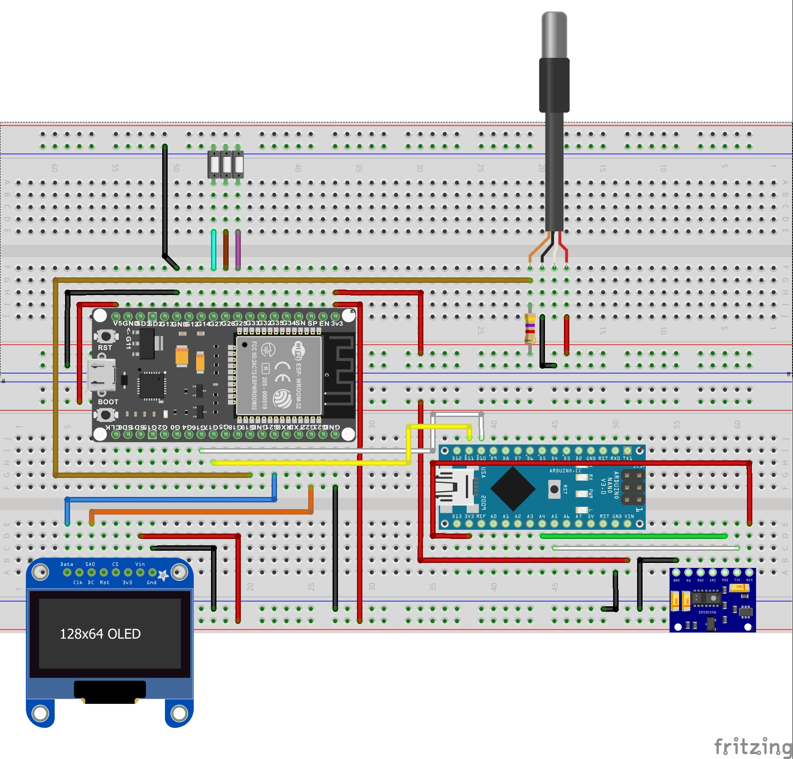

# WardIO
SMART SYSTEM HEALTH
# WardIO
> Projeto de um sistema de Pulsação, Oximetria e termômetro.

[![NPM Version][npm-image]][npm-url]
[![Build Status][travis-image]][travis-url]
[![Downloads Stats][npm-downloads]][npm-url]

Este projeto consiste de um oximetro MAX30100 um sensor de temperatura SSD1306 um Arduino NaNo e um ESP32,  
ligados a internet através do wifi e com configuração automática. 
Uma página hospedada no Firebase e um banco de dados feito para este produto, 
ela atualiza automaticamente a temperatura e envia para o firebase onde a página mostra em tempo real  
os dados verificados pelos sensores.

>>>>>>> f3a5bdbd1afb624adabcf41039b060f9a8a55d1d

